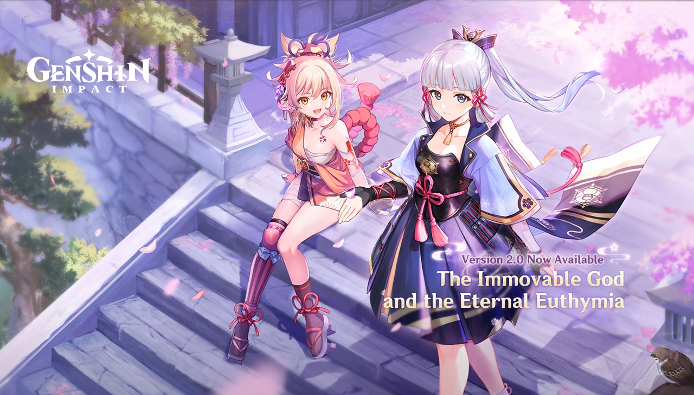

# Welcome

TODO
* Note on accuracy of in game books
* Note on outside links

# Manga

Genshin Impact had a brief 16 chapter Manga that takes place an estimated 1-2 years before the traveler wakes up. 

The official English translations of chapters 1-13 can be found on [hoyoverse](https://genshin.hoyoverse.com/en/manga) and a brief summary of each chapter can be found on the [wiki](https://genshin-impact.fandom.com/wiki/Manga). 

The manage contains backstory to Kayea & Diluc, the harbinger Il Dottore, and Collei (introduced in-game in 3.0). Note that while the manga is considered canon, there are a few discrepancies regarding Diluc (see wiki for more info).

# Mondstat / Liyue

## 1.0: Welcome To Teyvat

### Archon Quest

* Prologue Act I: The Outlander Who Caught the Wind
* Prologue Act II: For a Tomorrow Without Tears
* Prologue Act III: A New Star Approaches
* Chapter 1 Act I: Of the Land Amidst Monoliths
* Chapter 1 Act II: Farewell, Archaic Lord

### Story Quest

* Kaeya: Secret Pirate Treasure
* Amber: Wind, Courage, and Wings
* Xiangling: Mondstadt Gastronomy Trip
* Lisa: Troublesome Work
* Diluc: Darknight Hero's Alibi
* Razor: The Meaning of Lupical
* Xingqiu: Bookworm Swordsman
* Klee: True Treasure
* Jean: Master's Day Off
* Venti: Should You Be Trapped in a Windless Land
* Mona: Beyond This World's Stars

## 1.1: A New Star Approaches

### Archon Quest

* Chapter I: Act III - A New Star Approaches

### Story Quest

* [Tartaglia: Mighty Cyclops' Adventure!](https://genshin-impact.fandom.com/wiki/Mighty_Cyclops%27_Adventure!)
  * **Summary**: The Traveler and Paimon investigate a Ruin Guard disturbance near Lingju Pass and encounter Teucer, a young boy from Snezhnaya searching for his brother, a 'toy seller' in Liyue. They discover that Teucer's brother is Childe, who maintains a facade to hide his identity as a Fatui Harbinger. Childe asks the Traveler and Paimon to accompany Teucer around Liyue while he attends to business. During their tour, Teucer insists on visiting his brother, leading them to witness Childe's dealings with Treasure Hoarders and Fatui recruits. To preserve his cover, Childe improvises explanations for his actions. Later, Teucer requests to see the 'Institute for Toy Research,' which is actually an abandoned Ruin Guard facility. Childe leads them there and, to protect Teucer, uses his Foul Legacy Transformation to destroy the Ruin Guards, injuring himself in the process. Before Teucer departs for Snezhnaya, Childe secretly gives him a Mr. Cyclops action figure. Teucer thanks the Traveler and Paimon for the adventure, and Childe expresses gratitude for their help in maintaining his cover.
  * **Characters**: Childe, Teucer
  * **Important Lore**:
    * Teucer is Childe's youngest sibling and is unaware of his brother's true occupation.
    * Childe utilizes his Foul Legacy Transformation to combat Ruin Guards, injuring himself in the process as he hadn't fully recovered from using it last at the Golden House.
    * Childe's dedication to his family is profound, often placing their well-being above his own safety.
    * ||TODO - test spoiler||

* [Zhongli: Sal Flore](https://genshin-impact.fandom.com/wiki/Sal_Flore)
  * **Summary**: The Traveler and Paimon join Zhongli on an archaeological expedition to uncover relics of the God of Salt, Havria. Alongside them are Wanyan, an ardent follower of Havria, and Kliment, a Fatui archaeologist with ulterior motives. Upon discovering the ruins, Zhongli proposes a contract: each person may claim one relic in turn. However, Kliment breaks the agreement out of greed and is swiftly expelled by Zhongli. Wanyan, seeking to vindicate Havria and condemn Morax, also violates the contract. She learns a harsh truth: Havria was betrayed and slain by her own people during the Archon War. Disillusioned, Wanyan departs in silence. The quest concludes with Zhongli reflecting on history's fragility and entrusting the Traveler with preserving Liyue's legacy.
  * **Characters**: Zhongli, Havria
  * **Important Lore**:
    * Havria, the God of Salt, was a gentle deity betrayed and killed by her own followers during the Archon War.
    * The betrayal led to the salinization of many of her followers, preserving their final moments in salt.
    * Zhongli tells the traveler he wanted them to join him to carry on the memory of Havria should the Traveler move on and Teyvat be destroyed.
      > History records, but history may be changed. This incident proved that. Time is a mighty force, and histories twist in its flow...
      >
      > I need to find a better way of recording history in order to engrave its truth.
      >
      > Stone carvings were one such ancient method. But unchanging stone, immovable earth, even one such as myself... Someday, we may all disappear. Therefore, I thought of you, Traveler.
      >
      > You are one who crosses the celestial atlas, and who passes through countless worlds. If our history is engraved in your memory, it will one day accompany you into another world.
      >
      > As long as a Traveler like you is able to record what happened, then a backup of sorts will exist for times and tides of Teyvat.

### Event

* [Unreconciled Stars](https://genshin-impact.fandom.com/wiki/Unreconciled_Stars)
  * **Summary**: Mysterious meteorites crash into Mondstadt and Liyue, causing people to fall into a deep slumber filled with strange dreams. The Traveler teams up with Fischl and Mona to investigate the phenomenon. Mona uses her astrological skills to predict meteorite strike zones, while Fischl assists in the field. During the investigation, they encounter Scaramouche, a mysterious figure from Inazuma who claims to be researching the same issue. As the team collects meteorite shards and battles waves of enemies drawn to the meteorites' energy, they uncover that the meteorites are remnants of a fallen constellation containing the will of Leonard. He was an adventurer with a burning desire to scale the highest peaks and later develop a means of flight.
  * **Characters**: Fischl, Mona, Scaramouche
  * **Important Lore**:
    * This event was Fischl's first appearence
      * Her real name is Amy
      * Her persona, the "Prinzessin der Verurteilung", is a self-styled identity, but one she uses with great sincerity to express herself.
      * Oz mentions that Fischl adopted this persona to deal with being misunderstood and isolated due to her unusual behavior and interests.
      * She works for the Adventurers' Guild and is officially recognized and trusted with major assignments
    * This event was Scaramouche's first appearence
      * He is a Fatui harbinger
    * Towards the conclusion, Scaramouche states he realized: **"The stars, the sky... It's all a gigantic hoax. A lie."** and mentions the Jester most likely already knew of this

## 1.2: The Chalk Prince and the Dragon

### Story Quest

* [Albedo: Traveler Observation Report](https://genshin-impact.fandom.com/wiki/Traveler_Observation_Report)
  * **Summary**: The Traveler is invited by Sucrose to assist her mentor, Albedo, the Chief Alchemist of the Knights of Favonius, with his research in Dragonspine. Albedo is investigating a seed from another world and wants to see if he can make it flourish with the help of your elemental powers. Meanwhile, Rosaria tails behind them to ensure Albedo's experiments do not pose a threat to Mondstat. The quest concludes with Albedo noticing no abnormalities in how the Traveler interacts with the elements. As the experiment concludes and the traveler leaves, Albedo wonders to himself:
    > I made a point throughout of telling (‍him/her‍) how ordinary the results were...
    >
    > But what was that sediment I saw forming at the bottom of the vial? It should not have been there... What could it mean?
    >
    > Those born of earth are bound by its imperfections, but those born of chalk are free of impurities... You and I are alike, both composed of a substance that has yet to be fully defined...
    >
    > If one day, I lose control... destroy Mondstadt... destroy everything...
    >
    > Can I rely on you to stop me?
  * **Characters**: Albedo, Sucrose, Rosaria
  * **Important Lore**:
    * Albedo is first introduced
      * the Chief Alchemist and Captain of the Investigation Team of the Knights of Favonius.
      * TODO[where mentioned] Albedo was raised by Rhinedottir, a renowned alchemist, and has no memory of any blood relatives.
      * Sucrose is Albedo's assistant and a fellow alchemist interested in bio-alchemy.
    * Rosaria is first introduced
      * Rosaria is a nun of the Church of Favonius; however, she does not act the part.
      * She doesn't trust Albedo, and warns the traveler about blindly following him in his experiments.
* [Ganyu: Sea of Clouds, Sea of People](https://genshin-impact.fandom.com/wiki/Sea_of_Clouds,_Sea_of_People)
  * **Summary**: The Traveler and Paimon are tasked with finding Ganyu after she fails to return from delivering a letter to the adepti. Ganyu, feeling out of place among humans due to her half-qilin heritage, is undergoing trials set by Cloud Retainer and Xiao to reconnect with her adeptus roots. After completing the trials, Ganyu is finally able to resolve her inner conflicts and realizes she feels more at home among humans. She returns to Liyue Harbor, embracing her role as a bridge between humans and adepti.
  * **Characters**: Ganyu, Cloud Retainer, Xiao, Ningguang, Uncle Tian
  * **Important Lore**:
    * Ganyu is a half-qilin adeptus who serves as the secretary to the Liyue Qixing.
      * She is a workaholic, with her work-load compleatly overwhelming Ningguang's 3 secretaries in her absence.
      * She has lived for thousands of years.
    * Uncle Tian is introduced as the Tianshu of the Liyue Qixing, who is responsible for policymaking.

### World Quest

* Dragonspire
  * **Note**: Dragonspire's story telling is very different from later world quests and relies heavily on the FromSoftware. Below is a brief summary of the lore learned through various sources in version 1.2
  * **Lore**:
    * In ancient times, the civilazation of Sal Vindagnyr existed on the mountain. Their civilization centered around a large white tree which was of great importance to their culture. For unknown reasons, a nail split off from Celestia and landed near the summit. The city became shrouded in cloud and mist, drawn about by snowstorms. A hero from another land who resided in Sal Vindagnyr left to find answers. Meanwhile, their sacred tree began to wither away. Attempts to heal it all proved fruitless. As the end of their civilazation drew near, a scribe cursed the heavens for forsaking them, wishing for a nation with no god to one day emerge. An unknown time later, the hero returned only to find that everyone had already perished.
    * During the catacalysm, the corrupted dragon Durin descended upon Dragonspire. Before he could reach Mondstadt, he was slain by Dvalin. The blood from Durin's remains began to seep into the region, eventually reaching the roots of the sacred tree.
      * Vol. 1 of [*Breeze Amidst the Forest*](https://genshin-impact.fandom.com/wiki/Breeze_Amidst_the_Forest) claims Durin was a creation of the alchemist Rhinedottir (aka Gold)

### Event

* [The Chalk Prince and the Dragon](https://genshin-impact.fandom.com/wiki/The_Chalk_Prince_and_the_Dragon/Story)
  * **Summary**: The Traveler and Paimon join Sucrose in Dragonspine to assist Albedo with his research. Albedo entrusts them with a mysterious sword called Festering Desire, requesting they test it in combat. As they delve deeper, they uncover that the sword contains remnants of Durin, a dragon once defeated by Dvalin. The Fatui, learning of the sword's power, attempt to seize it, but are thwarted by the Traveler and Albedo. Through a series of trials, the sword is purified, and its power is stabilized. The event concludes with Albedo expressing gratitude and once again musing to himself:
    > This dragon's life force resonates with me...
    >
    > Not because it's a dragon, but because I am... me.
    >
    > Rhinedottir... Master... Is this your creation, the giant dragon Durin?
    >
    > Was the two of us meeting really a good thing?
  * **Characters**: Albedo, Sucrose
  * **Important Lore**:
    * Festering Desire is a sword imbued with remnants of Durin's power.
    * Durin was a dragon defeated by Dvalin and his remains rest in Dragonspine.
    * Rhinedottir is Albedo's master

## 1.3: All That Glitters

### Archon Quest

* Bough Keeper: Dainsleif

### Story Quest

* [Xiao: Butterfly's Dream](https://genshin-impact.fandom.com/wiki/Butterfly%27s_Dream)
  * **Summary**: The Traveler and Paimon encounter hilichurls near Wangshu Inn emitting a dark aura. They meet a masked man claiming to be an adeptus named Starsnatcher, who offers exorcisms for Mora. Suspicious of his authenticity, they investigate further and discover that Starsnatcher is a fraud exploiting people's fears. With Xiao's guidance, they perform a ritual to confront Starsnatcher's spirit while he is asleep. After making an example out of him, Starsnatcher apologizes and decides to go on a pilgramige of self reflection on his own accord.
    > Pervases: I sense his aura upon you... that, and the heavy burden of his karma.
    >
    > *sigh* Even after all these millennia, he still must endure such tremendous suffering? ...I am truly ashamed.
    >
    > Life is a precious thing, yes... But when I think of the burden that the Conqueror of Demons must bear... *sigh* death seems to me to have been the easy way out. A selfish indulgence, even.
    >
    > Birthdays are joyful occasions, but by the same token, it is hard to not be melancholy on the anniversary of one's death.
  * **Characters**: Xiao, Pervases, Starsnatcher
  * **Important Lore**:
    * Xiao radiates bad karma which he has accumulated from centuries of slaughtering demons. It can have a negative influence on monsters and people around him without visions.
    * He is the last remaining Yaksha.
    * Pervases was another Yaksha who fell in battle thousands of years ago. His spirit returns on the anniversary of his death due to an adeptus art he cast before passing.
  * **Media** [Story Teaser - Yakshas: The Guardian Adepti | Genshin Impact](https://www.youtube.com/watch?v=Wv-Tr-sSoCs)
* [Hu Tao: Yet the Butterfly Flutters Away](https://genshin-impact.fandom.com/wiki/Yet_the_Butterfly_Flutters_Away)
  * **Summary**: The Traveler and Paimon encounter Hu Tao, the 77th Director of the Wangsheng Funeral Parlor, while investigating supernatural occurrences in Wuwang Hill. They meet Meng, an intern haunted by a childhood ghost named Big G. Hu Tao enlists the Traveler's help to uncover the truth behind Big G's lingering spirit. The group gathers keepsakes from Big G's friends and conducts a farewell ceremony in a domain called the 'border.' After the ceremony, Big G finds peace and moves on to the afterlife. The quest concludes with Hu Tao expressing her appreciation for the Traveler's assistance and offering a deeper understanding of her role in guiding spirits.
    > As I explained, Wangsheng Funeral Parlor was, once upon a time, more akin to a doctor's office than an actual funeral parlor.
    >
    > During the Archon War, piles of corpses covered the wilderness. People were plunged into misery and suffering. Disease was spreading all over the land. Death devastated the world of the living.
    >
    > Such were the times when the Wangsheng Funeral Parlor was first established. As humans, its founders were deemed too insignificant to matter, but slowly, they managed to drive away death.
    >
    > After generations, Liyue Harbor became a bustling hub of prosperity, luring people with dreams of great fame and abundant Mora. But in the end, some lunatics stirred up the "legacy" of the dead.
    >
    > By that, I mean the remnants of the defeated gods that ravaged the world. I won't go into specifics of that situation, but suffice to say that at its peak, life was on the verge of bringing about its own extinction, while death was coming back with a vengeance.
    >
    > It took a long, long time, longer than you'd think, to restore balance and reinstate the "border." Without it, Liyue Harbor as we know it wouldn't be here today — neither would the Wangsheng Funeral Parlor, you, or me.
    >
    > What you make of my words is up to you. I do hope that most of it flew over your heads, though. The Wangsheng Funeral Parlor is just that, a funeral parlor. Nothing more to it.
    >
    > We live in peaceful times, but this harmonious coexistence between life and death should never be taken for granted.
  * **Characters**: Hu Tao, Meng, Big G
  * **Important Lore**:
    * The 'border' is the domain seperating life and death for all those connected to Teyvat's leylines.
    * Many of the spirits which linger on the border still long for the world of the living.
    * Hu Tao is first introduced:
      * She is the 77th Director of the Wangsheng Funeral Parlor in Liyue.
      * She is capable of seeing spirits, and helps maintain the balance on the border in her role of the director

### Event

* [Lantern Rite](https://genshin-impact.fandom.com/wiki/Lantern_Rite/Story)
  * **Summary**: During Liyue's Lantern Rite Festival, the Traveler and Paimon are asked by Verr Goldet to check on Xiao, who is reluctant to participate in the festivities. While enjoying the festival, they uncover a suspicious individual near the Mingxiao Lantern's construction site. Their investigation leads them to Mondstadt, where Kaeya helps identify the suspect as a member of the Treasure Hoarders. After thwarting the suspect's misguided plan, they return to Liyue. To include Xiao in the celebrations, they set up a mini-festival at Wangshu Inn. Eventually, they convince Xiao to accompany them to a vantage point to view the Mingxiao Lantern, allowing him to quietly appreciate the festival.
  * **Characters**: Xiao
  * **Important Lore**:
    * The Mingxiao Lantern is a massive lantern built annually during the Lantern Rite Festival, with materials contributed by the people of Liyue.
      * This years Mingxiao Lantern was dedicated to Skybracer, a fallen adeptus who sacrificed himself to protect Mt. Tianheng.
  * **Media**: [Ending Cinematic](https://www.youtube.com/watch?v=62xgOohZbLY) (video released before 1.0 launched)

## 1.4: Invitation of Windblume

### Archon Quest

* Chapter I: Act IV - We Will Be Reunited

### Event

* Invitation of Windblume
  * **Summary**: Mondstadt's Windblume Festival is a time of love and freedom. The Traveler and Paimon arrive in Mondstadt to find it adorned for the festival. They engage in various activities, including helping Venti with love poems and assisting Kaeya with his 'homework,' which involves delivering a letter written in Hilichurlian. Barbara receives a cryptic message leading to a Windwheel Aster Wreath from her fan club. Sucrose seeks to create a 'Windblume' through alchemy, resulting in a giant Sweet Flower variant. Bennett and Razor are found trapped in a Ruin Guard's prison cell at the Thousand Winds Temple. The Traveler is honored as the 'Windblume Star' and participates in the Windblume Ceremony with Jean, making an offering to the Anemo Archon. Venti later discusses the true meaning of the Windblume Festival at Stormterror's Lair, emphasizing its spirit of love and freedom.
  * **Characters**: Rosaria, Mondstat Cast
  * **Important Lore**:
    * The Windblume Festival has evolved from commemorating Mondstadt's liberation to celebrating love and freedom.
  * **Media**: ["Floral Breeze" - Scenes from Windblume Festival | Genshin Impact](https://www.youtube.com/watch?v=HRksKER0Ies)

## 1.5: Beneath the Light of Jadeite

### Story Quest

* Zhongli: No Mere Stone
  * **Summary**: The Traveler investigates the disappearance of miners in Liyue. Teaming up with Zhongli and a mysterious man named Kun Jun, they uncover clues leading to an ancient tree near Nantianmen. There, they find a sealed cave where the miners are entranced, and a confrontation with the dragon Azhdaha ensues. Azhdaha, once a friend of Zhongli, seeks revenge for being sealed away centuries ago. After defeating Azhdaha, it's revealed that Kun Jun is a manifestation of Azhdaha's remaining consciousness. The quest concludes with Azhdaha's departure and Zhongli reflecting on their past friendship.
  * **Characters**: Zhongli, Azdaha
  * **Important Lore**:
    * Azhdaha is a powerful dragon who was once a friend of Morax but was sealed away due to his destructive tendencies.
  * **Media**: [Story Teaser: Through the Eyes of a Dragon | Genshin Impact](https://www.youtube.com/watch?v=1jUemn6Jk-o)

## 1.6: Midsummer Island Adventure

### Archon Quest

* Chapter II Prologue: "Autumn Winds, Scarlet Leaves"

### Event

* Midsummer Island Adventure
  * **Summary**: Klee receives a mysterious letter from someone named 'Dodo-King,' threatening to take her companion Dodoco away. To investigate, the Traveler, Klee, Jean, Barbara, and Venti journey to the Golden Apple Archipelago, a newly discovered group of islands. There, they face various challenges, including sea battles, timed races, and a confrontation with the new boss, Maguu Kenki. As they progress, they uncover clues leading to the identity of Dodo-King. Ultimately, it's revealed that Dodo-King is Klee's mother, Alice, who orchestrated the entire adventure as a playful summer experience for Klee and her friends.
  * **Characters**: Klee, Jean, Barbara, Venti, Albedo
  * **Important Lore**:

# Inazuma

## 2.0: The Immovable God and the Eternal Euthymia

### Archon Quest

* Chapter 2 Act I: The Immovable God and the Eternal Euthymia
* Chapter 2 Act II: Stillness, the Sublimation of Shadow

### Story Quest

* Kamisato Ayaka: The Whispers of the Crane and the White Rabbit
* Yoimiya: Dreamlike Timelessness

### Event

* Thunder Sojourn
  * **Summary**:
  * **Characters**:
  * **Important Lore**:

## 2.1: Floating World Under the Moonlight

### Archon Quest

* Chapter 2 Act III - Omnipresence Over Mortals

### Story Quest

* Raiden Shogun: Reflections of Mortality
* Sangonomiya Kokomi: Warriors' Dreams Like Spring Grass Renewing

### Event

* Moonlight Merriment

## 2.2: Into the Perilous Labyrinth of Fog

### World Quest

* Through the Mists

### Event

* Labyrinth Warriors

## 2.3: Shadows Amidst Snowstorms

### Story Quest

* Arataki Itto: Rise Up, Golden Soul

### Event

* Shadows Amidst Snowstorms

## 2.4: Fleeting Colors in Flight

### Archon Quest

* Interlude Chapter Act I: "The Crane Returns on the Wind"

### World Quest

* Enkanomiya

### Event

* Fleeting Colors in Flight

## 2.5: When the Sakura Bloom

### Story Quest

* Raiden Shogun: "Transient Dreams"
* Yae Miko: "The Great Narukami Offering"

### Event

* Three Realms Gateway Offering

## 2.6: Zephyr of the Violet Garden

### Archon Quest

* Chapter 2 Act IV: Requiem of the Echoing Depths

### Story Quest

* Ayato: The Firmiana Leaf Falls

### World Quest

* The Chasm

### Event

* Hues of the Violet Garden

## 2.7: Hidden Dreams in the Depths

### Archon Quest

* Interlude Chapter Act II - Perilous Trail

### Story Quest

* Yelan: Calculated Gambit

### Event

* Perilous Trail

## 2.8: Summer Fantasia

### Story Quest

* Kaedehara Kazuha: A Strange and Friendless Road

### Event

* Summertime Odyssey

# Sumeru

## 3.0: The Morn a Thousand Roses Brings

## 3.1: King Deshret and the Three Magi

## 3.2: Akasha Pulses, the Kalpa Flame Rises

## 3.3: All Senses Clear, All Existence Void

## 3.4: The Exquisite Night Chimes

## 3.5: Windblume's Breath

## 3.6: A Parade of Providence

## 3.7: Duel! The Summoners' Summit

## 3.8: Secret Summer Paradise

# Fontaine

## 4.0: As Light Rain Falls Without Reason

## 4.1: To the Stars Shining in the Depths

## 4.2: Masquerade of the Guilty

## 4.3: Roses and Muskets

## 4.4: Vibrant Harriers Aloft in Spring Breeze

## 4.5: Blades Weaving Betwixt Broocade

## 4.6: Two Worlds Aflame, the Crimson Night Fades

## 4.7: An Everlasting Dream Intertwined

## 4.8: Summertide Scales and Tales

# Natlan

## 5.0: Flowers Resplendent on the Sun-Scorched Sojourn

## 5.1: The Rainbow Destined to Burn