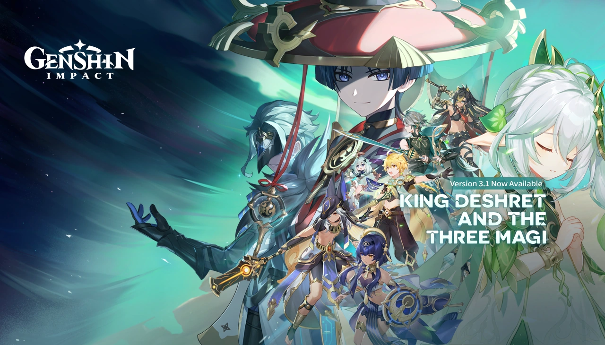
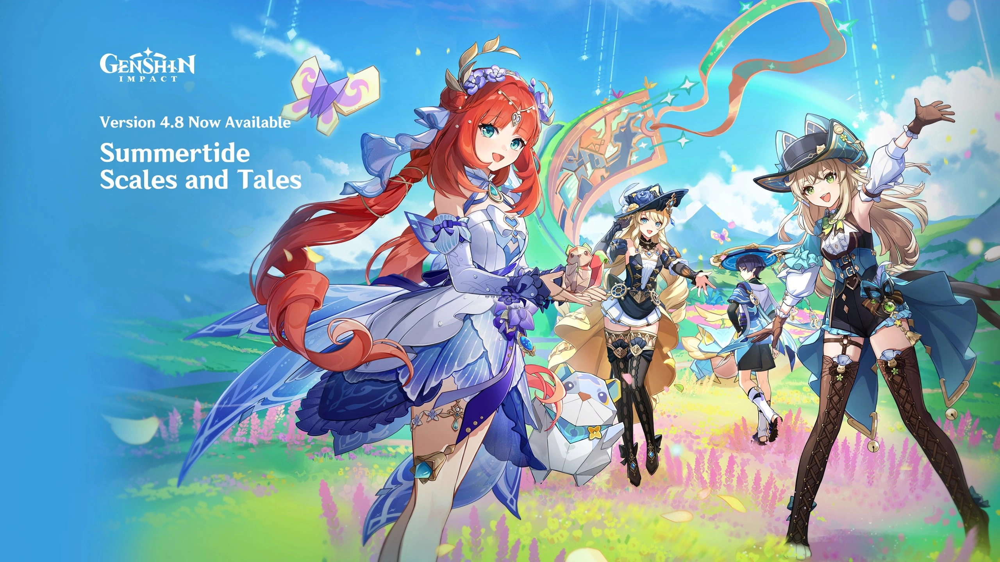

# Mondstat / Liyue

## 1.0: Welcome To Teyvat

### Archon Quest

- Prologue Act I: The Outlander Who Caught the Wind
- Prologue Act II: For a Tomorrow Without Tears
- Prologue Act III: A New Star Approaches
- Chapter 1 Act I: Of the Land Amidst Monoliths
- Chapter 1 Act II: Farewell, Archaic Lord

### Story Quest

- Kaeya: Secret Pirate Treasure
- Amber: Wind, Courage, and Wings
- Xiangling: Mondstadt Gastronomy Trip
- Lisa: Troublesome Work
- Diluc: Darknight Hero's Alibi
- Razor: The Meaning of Lupical
- Xingqiu: Bookworm Swordsman
- Klee: True Treasure
- Jean: Master's Day Off
- Venti: Should You Be Trapped in a Windless Land
- Mona: Beyond This World's Stars

### Event

## 1.1: A New Star Approaches

### Archon Quest

- Chapter I: Act III - A New Star Approaches

### Story Quest

- Tartaglia: Mighty Cyclops' Adventure!
- Zhongli: Sal Flore

### Event

- Unreconciled Stars
  - **Summary**: People all over Teyvat started collapsing after weird meteorites fell from the sky. I teamed up with Fischl and Mona to figure out what was going on. We traced the source to these ‘false stars’ messing with people’s minds. Just when we thought we had a lead, we met Scaramouche—seemed helpful, but he turned out to be a Fatui Harbinger and double-crossed us. In the end, we stopped the worst of the damage, but Scaramouche got away, and the bigger mystery behind the stars was left unsolved.
  - **Characters**: Fischl, Mona, Scaramouche
  - **Important Lore**:
    - Scaramouche is a fatui harbinger
    - The sky is false

## 1.2: The Chalk Prince and the Dragon

### Story Quest

- Albedo: Traveler Observation Report
- Ganyu: Sea of Clouds, Sea of People

### Event

- The Chalk Prince and the Dragon
  - **Summary**: In this snowy event set in the newly introduced Dragonspine region, the Traveler teams up with Albedo, the mysterious Chief Alchemist of the Knights of Favonius. Albedo is studying a strange substance called 'Dragonspine's Essence' and investigating a dark sword known as Festering Desire. As the investigation unfolds, it's revealed that the sword contains remnants of Durin, a corrupted dragon slain by Dvalin long ago. Albedo, whose origins are already a bit suspicious, struggles with the temptation of power and the morality of creation. The event concludes with Albedo deciding not to pursue forbidden knowledge for now, and he entrusts the Traveler with the enhanced Festering Desire. Meanwhile, the presence of mysterious forces (like the remnants of Gold’s experiments) lingers ominously.
  - **Characters**: Albedo, Sucrose, Amber
  - **Important Lore**:
    - Albedo is introduced as the Chief Alchemist of the Knights of Favonius and a student of the famed alchemist Rhinedottir.
    - Durin, a dragon created by Rhinedottir, was defeated by Dvalin but its remains still corrupt Dragonspine.
    - The sword Festering Desire contains remnants of Durin's power and can influence its wielder.

## 1.3: All That Glitters

### Archon Quest

- Bough Keeper: Dainsleif

### Story Quest

- Xiao: Butterfly's Dream
- Hu Tao: Yet the Butterfly Flutters Away

### Event

- Lantern Rite
  - **Summary**: Liyue comes together to celebrate their biggest annual tradition. As the city prepares for the release of thousands of Xiao Lanterns and a grand Mingxiao Lantern, the Traveler helps various citizens with preparations. The story focuses heavily on Xiao, the reclusive adeptus who is initially reluctant to join in the celebrations due to his karmic burden. Over time, he opens up slightly thanks to the Traveler’s efforts and memories of the past. Keqing also plays a big role, showing her commitment to Liyue’s future after Rex Lapis’s departure. The event culminates in a beautiful lantern release that honors those who’ve passed and brings the community together.
  - **Characters**: Xiao, Ganyu, Keqing, Ningguang, Zhongli, Xiangling, Chongyun, Xianyan
  - **Important Lore**:
    - Xiao fights karmic debt daily due to the centuries of battles he’s fought against evil spirits.
    - Xiao was saved by Rex Lapis (Morax) from enslavement by an evil god, which is why he serves Liyue.

## 1.4: Invitation of Windblume

### Archon Quest

- Chapter I: Act IV - We Will Be Reunited

### Event

- Invitation of Windblume

## 1.5: Beneath the Light of Jadeite

### Story Quest

- Zhongli: No Mere Stone
- Eula: The Spindrift Shall Never Return to the Sea

## 1.6: Midsummer Island Adventure

### Archon Quest

- Chapter II Prologue: "Autumn Winds, Scarlet Leaves"

### Event

- Midsummer Island Adventure

# Inazuma

## 2.0: The Immovable God and the Eternal Euthymia

### Archon Quest

- Chapter 2 Act I: The Immovable God and the Eternal Euthymia
- Chapter 2 Act II: Stillness, the Sublimation of Shadow

### Story Quest

- Kamisato Ayaka: The Whispers of the Crane and the White Rabbit
- Yoimiya: Dreamlike Timelessness

### Event

- Thunder Sojourn

## 2.1: Floating World Under the Moonlight

### Archon Quest

- Chapter 2 Act III - Omnipresence Over Mortals

### Story Quest

- Raiden Shogun: Reflections of Mortality
- Sangonomiya Kokomi: Warriors' Dreams Like Spring Grass Renewing

### Event

- Moonlight Merriment

## 2.2: Into the Perilous Labyrinth of Fog

### World Quest

- Through the Mists

### Event

- Labyrinth Warriors

## 2.3: Shadows Amidst Snowstorms

### Story Quest

- Arataki Itto: Rise Up, Golden Soul

### Event

- Shadows Amidst Snowstorms

## 2.4: Fleeting Colors in Flight

### Archon Quest

- Interlude Chapter Act I: "The Crane Returns on the Wind"

### World Quest

- Enkanomiya

### Event

- Fleeting Colors in Flight

## 2.5: When the Sakura Bloom

### Story Quest

- Raiden Shogun: "Transient Dreams"
- Yae Miko: "The Great Narukami Offering"

### Event

- Three Realms Gateway Offering

## 2.6: Zephyr of the Violet Garden

### Archon Quest

- Chapter 2 Act IV: Requiem of the Echoing Depths

### Story Quest

- Ayato: The Firmiana Leaf Falls

### World Quest

- The Chasm

### Event

- Hues of the Violet Garden

## 2.7: Hidden Dreams in the Depths

### Archon Quest

- Interlude Chapter Act II - Perilous Trail

### Story Quest

- Yelan: Calculated Gambit

### Event

- Perilous Trail

## 2.8: Summer Fantasia

### Story Quest

- Kaedehara Kazuha: A Strange and Friendless Road

### Event

- Summertime Odyssey

# Sumeru

## 3.0: The Morn a Thousand Roses Brings

## 3.1: King Deshret and the Three Magi

## 3.2: Akasha Pulses, the Kalpa Flame Rises

## 3.3: All Senses Clear, All Existence Void

## 3.4: The Exquisite Night Chimes

## 3.5: Windblume's Breath

## 3.6: A Parade of Providence

## 3.7: Duel! The Summoners' Summit

## 3.8: Secret Summer Paradise

# Fontaine

## 4.0: As Light Rain Falls Without Reason

## 4.1: To the Stars Shining in the Depths

## 4.2: Masquerade of the Guilty

## 4.3: Roses and Muskets

## 4.4: Vibrant Harriers Aloft in Spring Breeze

## 4.5: Blades Weaving Betwixt Broocade

## 4.6: Two Worlds Aflame, the Crimson Night Fades

## 4.7: An Everlasting Dream Intertwined

## 4.8: Summertide Scales and Tales

# Natlan

## 5.0: Flowers Resplendent on the Sun-Scorched Sojourn

## 5.1: The Rainbow Destined to Burn